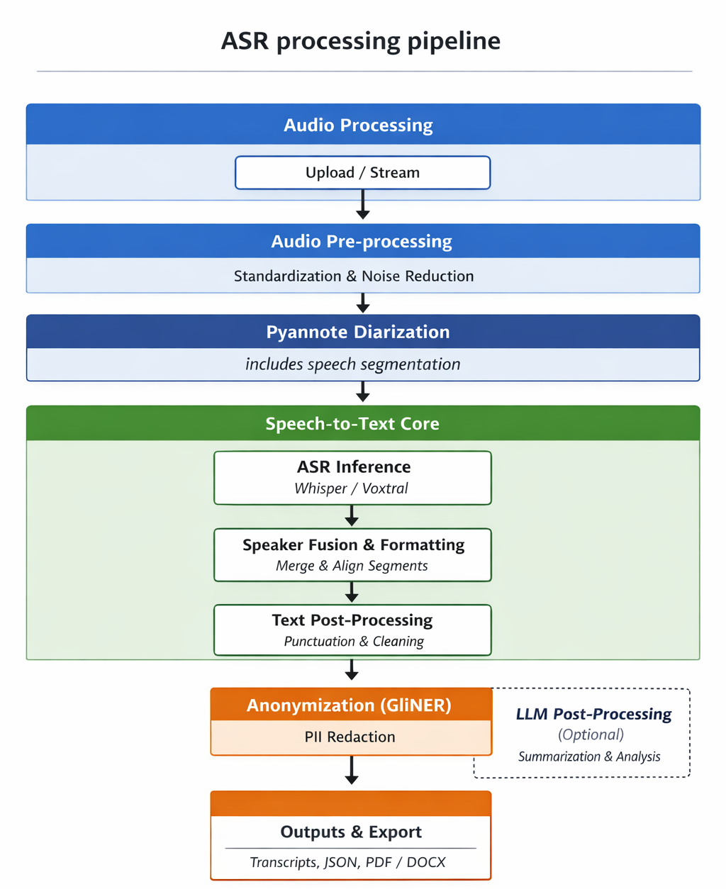

# ASR Jetson — Full Pipeline (Diarization + Transcription + Reporting)

Local end-to-end pipeline: audio ingestion → optional RNNoise denoise → Pyannote diarization → Faster-Whisper transcription → anonymization and LLM clean-up → meeting reports (Markdown / PDF / DOCX) via Mistral.

---

<p align="center">
  
</p>

---

## Key Points
- Auto-converts audio to 16 kHz mono WAV (`preprocessing/convert_to_wav.py`), optional RNNoise denoise (`preprocessing/rnnoise.py`).
- Diarization with Pyannote (`diarization/pipeline_diarization.py`) then ASR with Faster-Whisper (`asr/whisper_engine.py`, `asr/transcribe.py`).
- Exports JSON, SRT, dialogue TXT, anonymized variants + mapping, meeting reports (MD/PDF/DOCX).
- Anonymization via `postprocessing/transformer_anonymizer.py`; optional LLM clean (`postprocessing/llm_clean.py`).
- Mistral-powered reports using `postprocessing/meeting_report.py` and prompts in `config/mistral_prompts.json`.

---

## Repository Layout
```
src/asr_jetson/
  asr/             # Faster-Whisper load + segmented transcription
  config/          # Report HTML/CSS templates + Mistral prompts
  diarization/     # Pyannote pipeline
  pipeline/        # Orchestrator and CLI (asr-pipeline)
  postprocessing/  # Anonymization, LLM clean-up, report PDF/DOCX
  preprocessing/   # WAV conversion + RNNoise
```
Other folders: `configs/` (sample YAML), `tests/` (pytest), `docker/`, `scripts/`, `models/` and `outputs/` (caches, gitignored).

---

## Installation (uv)
Prereqs: Python 3.11, `ffmpeg` in PATH, CUDA GPU recommended, `uv` installed.

```bash
uv sync --extra dev              # CPU
# uv sync --extra dev --extra gpu-linux   # GPU x86_64
# uv sync --extra dev --extra gpu-jetson  # Jetson
```
Environment:
- `HUGGINGFACE_TOKEN` required for Pyannote diarization.
- `MISTRAL_API_KEY` required for report generation.

---

## CLI Usage

```bash
uv run asr-pipeline \
  --audio path/to/file.wav \
  --out-dir outputs \
  --device cuda \
  --whisper-model large-v3 \
  --whisper-compute int8_float16 \
  --lang fr \
  --denoise \
  --speakers 2 \
  --pyannote-pipeline pyannote/speaker-diarization-3.1 \
  --pyannote-token "$HUGGINGFACE_TOKEN" \
  --asr-prompt "Kleos, Pennylane, CJD" \
  --speaker-context "Anonymized speaker context for the report" \
  --meeting-date 2026-02-15 \
  --meeting-report-type entretien_collaborateur \
  --monitor-gpu-memory
```
Main flags (see `src/asr_jetson/pipeline/cli.py`):
- `--audio` (required): input audio (wav/mp3/flac); converted to WAV internally.
- `--out-dir`: root for JSON/SRT/TXT/reports/pdf.
- `--device`: `cuda` or `cpu`; falls back to CPU if CUDA unavailable.
- `--whisper-model`: Faster-Whisper id (e.g., `large-v3`, `openai/whisper-large-v3-turbo`).
- `--whisper-compute`: CTranslate2 compute type (`int8_float16` GPU, `int8` CPU). Auto-sanitized per device.
- `--lang`: forced language (ISO). Default `fr`.
- `--denoise`: enable RNNoise (ffmpeg arnndn/afftdn).
- `--speakers`: optional expected speaker count for Pyannote.
- `--pyannote-pipeline` / `--pyannote-token`: diarization config.
- `--asr-prompt`, `--speaker-context`, `--meeting-date`, `--meeting-report-type`: enrich transcripts and reports.
- `--report-only`: regenerate anonymization/report from existing transcripts in `out-dir`.
- `--monitor-gpu-memory`: log CUDA memory at checkpoints.

Reports: if `MISTRAL_API_KEY` or dependencies (`mistralai`, `weasyprint`, `pypandoc`, `python-docx`) are missing, report generation will error. There is no CLI switch to disable reporting.

---

## Outputs
- `json/<audio>_pyannote_<pipeline>_<whisper>.json`: diarization + ASR segments.
- `srt/<audio>_... .srt`: timestamped subtitles with speakers.
- `txt/<audio>_... .txt`: dialogue text.
- `txt/<audio>_..._clean.txt`: cleaned text when anonymization is off or when corrected.
- `txt/<audio>_..._anon.txt` and `_anon_clean.txt`: anonymized variants.
- `json/<audio>_..._anon_mapping.json`: anonymization mapping.
- `reports/<audio>_meeting_report_anonymized.md`: anonymized Mistral report.
- `reports/<audio>_meeting_report.md`, `pdf/compte_rendu_<audio>_<date>_<time>.{pdf,docx}`: deanonymized final report.
- `manifest.json`: run metadata (paths can be relative if `ASR_RECORDINGS_ROOT` is set).

---

## Tests
```bash
uv run pytest                 # full suite (integration needs tokens/models)
uv run pytest -m "not gpu"    # skip GPU-heavy tests
```

---

## Docker
```bash
docker build -t asr-jetson:dev -f docker/Dockerfile .
docker build -t asr-jetson:jetson -f docker/Dockerfile.jetson .
```

---

## Entry Points
- Primary entry: `uv run asr-pipeline` (alias `python -m asr_jetson.pipeline.cli`).
- Programmatic use: import and call `run_pipeline` from `pipeline/full_pipeline.py`.
